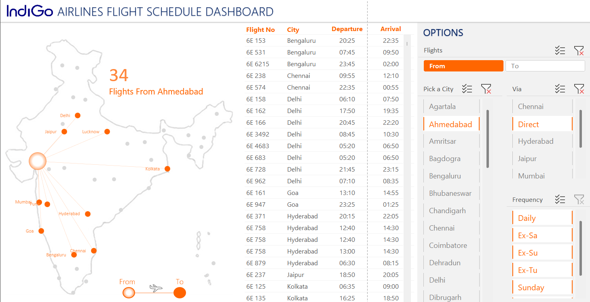

# ✈️ Indigo Flight Dashboard – Excel-Based Business Intelligence Project

## 📌 Project Overview

This project presents a comprehensive Excel dashboard built to analyze **Indigo Airlines flight data**. The goal was to extract key operational and performance insights using Excel's interactive tools like **PivotTables**, **Slicers**, and **VBA Macros**.

The dashboard helps stakeholders monitor flight operations and make data-driven decisions across metrics like:

- Flight punctuality  
- Revenue analysis  
- Route performance  
- Operational KPIs  

---

## 🎯 Objective

- Enable quick and clear visibility into Indigo Airlines' operational performance  
- Provide an intuitive, interactive business intelligence solution using only Microsoft Excel  
- Make insights accessible for non-technical stakeholders  

---

## 🧰 Tools Used

| Tool/Technology        | Purpose                                                  |
|------------------------|----------------------------------------------------------|
| Microsoft Excel        | Data modeling, visualization, and dashboard building     |
| PivotTables            | Aggregating and summarizing flight data                  |
| Slicers                | Interactive filtering                                    |
| VBA Macros (.xlsm)     | Automating repetitive tasks and improving UI             |
| Conditional Formatting | Enhancing visual clarity of KPIs                         |

---

## 📊 Key Features

- **Interactive Slicers:** Filter data by year, sector, route, and flight status  
- **Dynamic KPIs:** Visual performance indicators (e.g., On-time %, Revenue)  
- **Top Routes Analysis:** Displays best and worst-performing routes based on revenue and delays  
- **Monthly Trends:** Graphs showing revenue and punctuality trends over time  
- **Macro-enabled File:** Automation of sheet resets and interface polishing  

---

## 📈 Insights Unlocked

- **Top Revenue Routes:** `DEL-MUM` and `BLR-HYD` generated the highest revenue due to high frequency and load factors (via revenue-by-route PivotTable).  
- **Most Delayed Routes:** `CCU-BBI` and `HYD-VGA` had the most delays, as shown by high delay percentages in flight status summary.  
- **Monthly Trends:** Revenue peaked in **Dec and Mar** (holiday and fiscal year-end), while OTP dropped in **July–Aug** (monsoon impact), visible in monthly trend charts.  
- **Domestic vs. International:** Domestic routes showed higher revenue and better OTP (observed using sector-wise slicers).  
- **Dynamic Micro-Trends:** Slicer combinations revealed route-specific revenue spikes and OTP drops, enabling granular insights.  

---

## 🧩 How It Works

- **Data Source:** Historical Indigo flight data  
- **Processing:** Cleaned and structured within Excel using Tables and PivotTables  
- **Visualization:** Dashboard built using charts, conditional formatting, and slicers  
- **Automation:** VBA macros allow users to reset slicers and maintain a clean user interface  

---

## ✅ Skills Demonstrated

- Data Cleaning and Preparation in Excel  
- Advanced PivotTables and Charting  
- Dashboard Design Principles  
